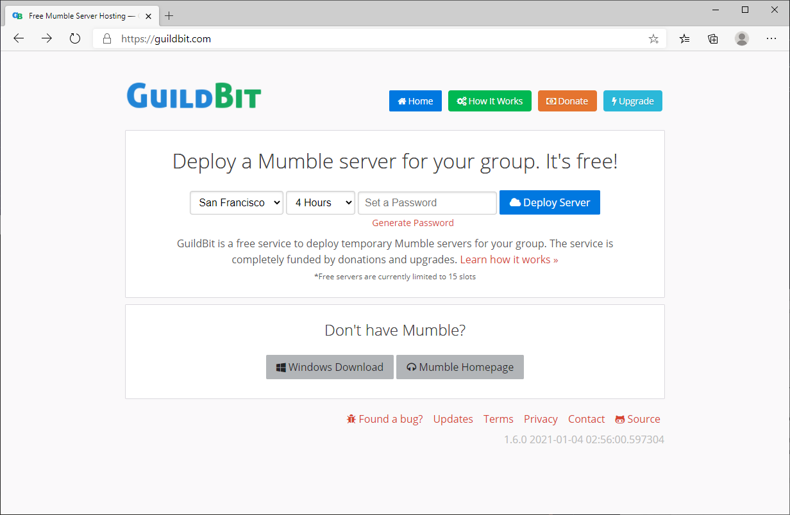
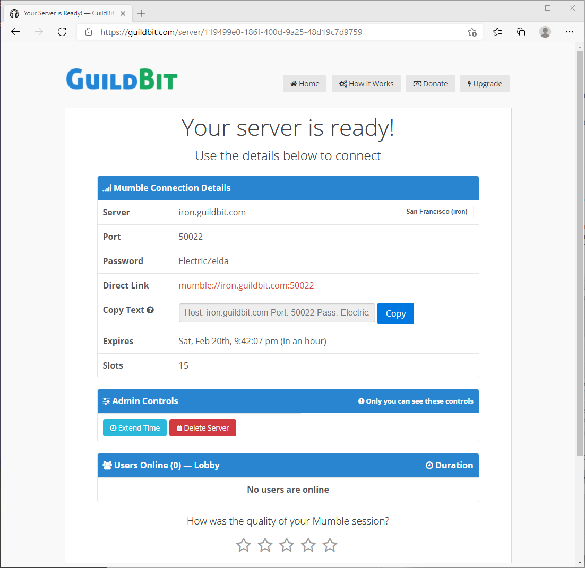

# GuildBit.com
> Free Mumble Hosting


GuildBit is a full-stack application written in Python to offer
temporary virtual Mumble servers to users. Guildbit depends on [murmur-rest](https://github.com/alfg/murmur-rest) API backend to interface
with the virtual Mumble servers.

https://guildbit.com

## Screenshots





## Technology Stack
* [Flask](http://flask.pocoo.org/) - Python Framework
* [Flask-SQLAlchemy](http://flask-sqlalchemy.pocoo.org/) - PostgreSQL/SQLite ORM
* [Celery](http://www.celeryproject.org/) - Message Queue for scheduling Mumble Server tasks
* [Redis](http://redis.io/) - Cache backend and message broker for Celery
* [Python-requests](http://docs.python-requests.org/en/master/) - HTTP requests to murmur-rest API
* [Murmur-rest](https://github.com/alfg/murmur-rest) - Murmur HTTP API

### Requirements
* Redis-server
* SQLite or PostgreSQL
* [Virtualenv](https://virtualenv.pypa.io/en/stable/) recommended for development
* [murmur-rest](https://github.com/alfg/murmur-rest)

*Please note `murmur-rest` MUST be setup in order to deploy virtual Mumble servers. However, it is possible to work on the Guildbit app without murmur-rest, you just won't be able to deploy or administer any Mumble servers.*


### Development Setup
```bash
$ git clone https://github.com/alfg/guildbit
$ virtualenv env --system-site-packages
$ . env/bin/activate
$ pip install -r requirements.txt
$ export FLASK_ENV=development
$ export FLASK_RUN_HOST=0.0.0.0
$ export FLASK_RUN_PORT=5000
$ flask run

* Running on http://0.0.0.0:5000/
* Restarting with reloader
```
* Database and schema will automatically be created via Flask-Migrate.
* Development server is running with default settings. See [Configuration Guide](https://github.com/alfg/guildbit/wiki/Configuration-Guide) for additional configuration options.
* Run celery in a separate process (but in the same python environment) to start the messaging queue:
  ```
  $ celery worker --app=app.tasks -l info
  ```

## Docker Setup
A Dockerfile and `docker-compose.yml` is provided for setting up a local development server.
```
$ docker-compose build
$ docker-compose up

redis_1 | * DB loaded from disk: 0.000 seconds
redis_1 | * The server is now ready to accept connections on port 6379
app_1   | * Running on http://0.0.0.0:8081/
app_1   | * Restarting with reloader
```

Load `http://localhost:8081` in your browser.

When deploying a server, you'll see the Direct Link as `mumble://murmur-rest:50001`. Simply, replace `murmur-rest` with `localhost`. 

*Please note the `docker-compose.yml` file opens ports 50001-50050 for testing. Update as needed.*

## Translations

Translations are welcome. To add or update a translation, please add a file or update a file in [https://github.com/alfg/guildbit/tree/master/app/translations](https://github.com/alfg/guildbit/tree/master/app/translations). For more information, please read the [wiki](https://github.com/alfg/guildbit/wiki/Commands-and-Fixes#updating-translations).

## Admin
See: [Activating Admin](https://github.com/alfg/guildbit/wiki/Commands-and-Fixes#activating-admin)

## Resources
* See [The Wiki](https://github.com/alfg/guildbit/wiki/Commands-and-Fixes) for further commands available.
* [Configuration Guide](https://github.com/alfg/guildbit/wiki/Configuration-Guide)

## License

[MIT License](http://alfg.mit-license.org/) © Alfred Gutierrez
